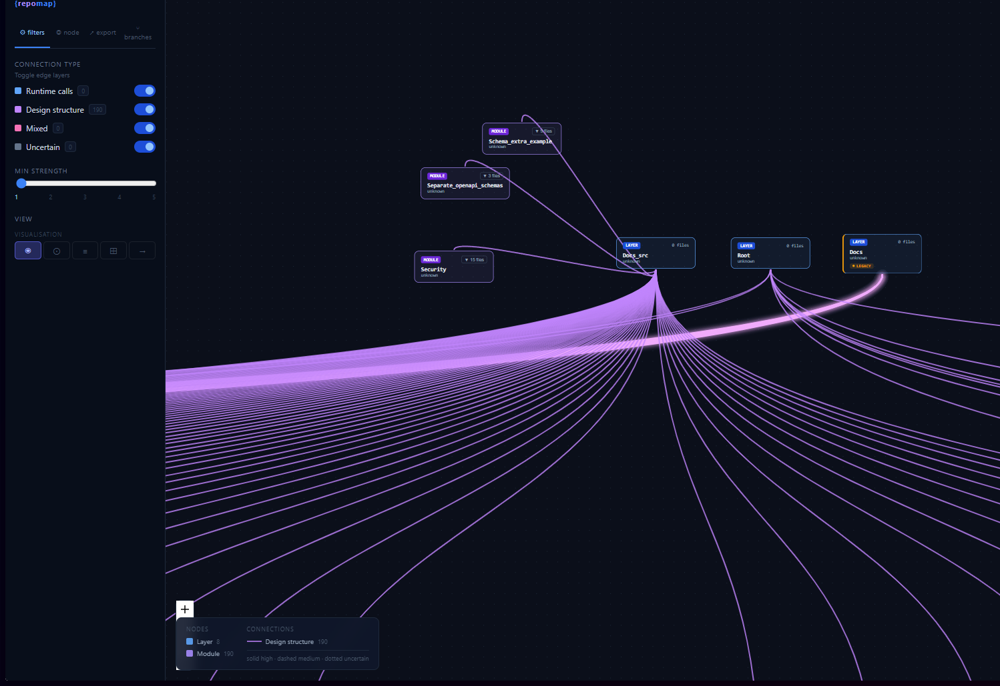

RepoMap

Give coding agents architectural awareness.

RepoMap extracts the structure of any repository without sending source code to an LLM, then generates an interactive architectural map that both humans and AI agents can understand.

[](https://youtu.be/EdsugA9Tz8Y)

[](https://youtu.be/EdsugA9Tz8Y)

Why RepoMap?

Modern coding agents spend a significant amount of time reconstructing a project's architecture.

They repeatedly open files, follow imports, inspect folders, and consume thousands of tokens just to answer questions like:

Where is authentication implemented?
Which modules depend on the database?
What architectural pattern does this project follow?
How are components connected?

RepoMap changes that workflow.

Instead of asking the LLM to rediscover the architecture every session, RepoMap builds a deterministic structural representation once and lets the agent reason over that representation.

The result is:

significantly fewer tokens spent on repository understanding
faster architectural reasoning
interactive visualization for humans
reusable architecture data for AI agents
Features

✅ Deterministic repository analysis

✅ Zero source code sent to the LLM

✅ Interactive architecture graph

✅ Automatic architectural role detection

✅ Architecture pattern recognition

✅ Multiple graph layouts

✅ Editable graphs with persistent branches

✅ Git history visualization

✅ Large repository support

How it works

RepoMap separates structure extraction from architectural reasoning.

```
Repository
     │
     ▼
Deterministic Analyzer
     │
     ▼
RawAnalysis
(no source code)
     │
     ▼
LLM
(architecture reasoning)
     │
     ▼
RepoGraph
     │
     ▼
Interactive visualization
```
Phase 1 — Deterministic Analysis

The analyzer never calls an LLM.

It scans the repository and extracts:

directory hierarchy
imports
function signatures
module relationships
git information

The result is a compact RawAnalysis that describes the repository structure without exposing the source code.

Phase 2 — Architectural Reasoning

Instead of reading thousands of files, the LLM receives only the structured analysis.

From that information it can:

assign architectural roles
identify architectural patterns
improve module labels
generate a visualization layout

Only one reasoning step is required.

Phase 3 — Interactive Exploration

RepoMap renders the generated architecture as an editable graph.

Features include:

React Flow visualization
multiple layouts
branch-based editing
node inspection
viewport culling
persistent local storage
Git-aware visualization

Architecture is not static.

RepoMap lets you explore repositories together with their Git history.

inspect commits
browse branches
highlight added files
highlight modified files
highlight deleted files

Future versions will expand this into full architectural diff visualization.

Why not let the LLM read the repository?

Because repository exploration is mostly deterministic.

Finding imports, discovering modules, following folders and extracting definitions does not require intelligence.

LLMs should spend their context reasoning about architecture—not reconstructing information that software can extract automatically.

This dramatically reduces token usage while producing a richer architectural representation.

Designed for coding agents

RepoMap was built to integrate naturally with tools such as OpenCode and Claude.

Instead of repeatedly exploring the repository, agents receive a compact structural model that can be reused for reasoning, visualization and future analysis.

Installation

```bash
git clone <repo-url>
cd repomap-pipeline-v2
npm install
```

The skill is auto-discovered by OpenCode from `.opencode/skills/repomap/`.

Quick Start

```bash
# Analyze a local repository and serve the interactive map
node .opencode/skills/repomap/cli.js open my-repo

# Or from code:
import { analyze } from './.opencode/skills/repomap/index.js'
const raw = await analyze({ localPath: '/path/to/repo' })
```

```bash
# List all saved maps
node .opencode/skills/repomap/cli.js list
```

RepoGraph format

```json
{
  "meta": {
    "repoName": "owner/repo",
    "estimatedSize": "small|medium|large",
    "languages": ["TypeScript", "Python"],
    "totalFiles": 42,
    "totalModules": 8
  },
  "nodes": [
    { "id": "layer__src", "label": "Src", "type": "layer", "parentId": null, "files": [], "metadata": {} },
    { "id": "module__src_core", "label": "Core", "type": "module", "parentId": "layer__src", "files": ["core/index.ts"], "metadata": {} },
    { "id": "file__core_index_ts", "label": "index.ts", "type": "file", "parentId": "module__src_core", "files": ["core/index.ts"], "metadata": { "language": "TypeScript", "lineCount": 150, "complexity": "medium" } }
  ],
  "edges": [
    { "id": "edge__file1__file2", "source": "file__core_index_ts", "target": "file__utils_helpers_ts", "edgeType": "engineering", "strength": 3, "label": "imports", "confidence": "high" },
    { "id": "edge__layer__module", "source": "layer__src", "target": "module__src_core", "edgeType": "architecture", "strength": 5, "label": "contains", "confidence": "high" }
  ],
  "overlay": {
    "version": 0,
    "nodeOverrides": {},
    "edgeOverrides": {},
    "manualNodes": [],
    "manualEdges": []
  }
}
```

CLI

```
node cli.js list              List all saved maps
node cli.js open <name>       Open a map by name, file name, or partial match
```

All commands run from `.opencode/skills/repomap/`.

Architecture

```
.opencode/skills/repomap/
  analyzer.js     Deterministic scanner: file tree, imports, definitions, signatures, git data
  index.js        Orchestration: analysis → persist → serve visualization
  cli.js          CLI wrapper (list, open)
  visual_src/     React Flow-based interactive graph renderer (published as @frannn2114/repomap-visual)
```

The pipeline is:
1. **analyzer.js** extracts structure without calling an LLM
2. **index.js** saves the result as a RepoGraph JSON and spawns a visual server
3. **cli.js** provides `list` and `open` commands for saved maps

License

MIT&und